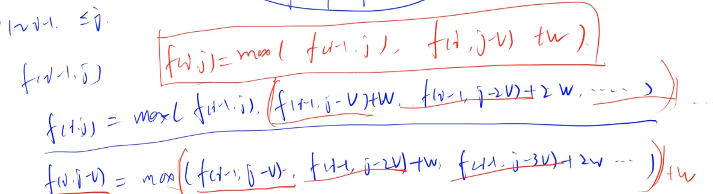

# 快速排序

1. 确定分界点 左、中、右、随机
2. 调整范围 <= x ; >=x (双指针做法)
3. 递归处理左右两段

```c++
void quick_sort(int q[],int l,int r){
    if(l == r) return ;
    int x = q[(l+r)/2];
    int i = l-1;
    int j = r+1;
    while(i<j){
        do i++; while(q[i]<x);
        do j--; while(q[j]>x);
        if(i<j) swap(q[i],q[j]);
    }
    quick_sort(q,l,j);
    quick_sort(q,j+1,r);
    
}
```

## 快速选择

```c++
int quick_select(int l,int r,int k){
    if(l==r) return q[(l+r)/2];
    int i=l-1;int j = r+1; int x= q[(l+r)/2];
    
    while(i<j){
        do i++; while(q[i]<x);
        do j--; while (q[j]>x);
        if(i<j) swap(q[i],q[j]);
    }
    
    if(k<=j-l+1) quick_select(l,j,k);
    else quick_select(j+1,r,k-(j-l+1));
}
```

# 归并排序

1. 确定分界点 mid = (l+r)/2

2. 递归排序 left、right

3. 归并合二为一（重要）

   ```c++
   void merge_sort(int q[],int l,int r){
       if(l>=r) return ;
       int mid = (l+r)/2;
       merge_sort(q,l,mid);
       merge_sort(q,mid+1,r);
       int i = l;
       int j = mid + 1;
       int k = 0;
       while(i<=mid && j <= r){
           if(q[i]<q[j]) tmp[k++] = q[i++];
           else tmp[k++] = q[j++];
       }
       while(i<=mid){
           tmp[k++] = q[i++];
       }
       while(j<=r){
           tmp[k++] = q[j++];
       }
       for(k=l,j=0;k<=r;k++,j++) q[k] = tmp[j];
   }
   ```

   

## 求数组中的逆序对数量

```c++
LL merge_sort(int l,int r){
    if(l>=r) return 0;
    int mid = l+r>>1;
    LL res = merge_sort(l,mid)+merge_sort(mid+1,r);
    
    int i=l;int j = mid+1; int k = 0;
    while(i<=mid && j<=r){
        if (q[i]<=q[j]){
            tmp[k++] = q[i++];
        }else{
            tmp[k++] = q[j++];
            res += mid-i+1;
        }
    }
    while(i<=mid){
        tmp[k++] = q[i++];
    }
    while(j<=r){
        tmp[k++] = q[j++];
    }
    for(k=0,i=l;i<=r;k++,i++) q[i]=tmp[k];
    return res;
}
```

# 高精度加法

```c++
vector<int> add(vector<int> & v1,vector<int> & v2){
    vector<int> result;
    int temp = 0;
    for(int i=0;i<v1.size() || i< v2.size();i++){
        if(i<v1.size()) temp+=v1[i];
        if(i<v2.size()) temp+=v2[i];
        result.push_back(temp%10);
        temp/=10;
    }
    if(temp){
        result.push_back(1);
    }
    return result;
}
```

# 高精度减法

```c++
vector<int> sub(vector<int> &A, vector<int> &B)
{
    if(A.size()<B.size() || A.size()==B.size() && A.back()<B.back()) return sub(B,A);
    vector<int> C;
    for (int i = 0, t = 0; i < A.size(); i ++ )
    {
        t = A[i] - t;
        if (i < B.size()) t -= B[i];
        C.push_back((t + 10) % 10);
        if (t < 0) t = 1;
        else t = 0;
    }

    while (C.size() > 1 && C.back() == 0) C.pop_back();
    return C;
}
```


```c++
vector<int> jian(vector<int> & v1,vector<int> &v2){
    if(v1.size()<v2.size() || v1.size()==v2.size() && v1[v1.size()-1]<v2[v1.size()-1]){
        return jian(v2,v1);
    }
    int flag = 0;
    vector<int> result;
    for(auto i=0;i<v2.size();i++){
        if(flag && v1[i]!=0) {v1[i]--;flag=0;}
        else if(flag && v1[i]==0) {v1[i]=9;flag=1;}
        else flag = 0;
        int temp = 0;
        if(v1[i]>=v2[i]){
            temp=(v1[i]-v2[i]);
        }
        else{
            temp=(v1[i]+10-v2[i]);
            flag = 1;
        }
        result.push_back(temp);
    }
    if(v1.size()>v2.size()){
        for(auto i=v2.size();i<v1.size();i++){
            if(flag && v1[i]!=0){
                v1[i]--;
                flag = 0;
            } 
            else if(flag && v1[i]==0){
                v1[i] = 9;
                flag = 1;
            }
            else{
                flag = 0;
            }
            result.push_back(v1[i]);
        }
    }
    return result;
}
```

# 前缀和(一维数组)

```c++
#include<iostream>
using namespace std;
const int N = 1e5+10;
int a[N] = {0};
int s[N] = {0};
int main(){
    int n,m;
    cin>>n>>m;
    for(int i=1;i<=n;i++) cin>>a[i];
    for(int i=1;i<=n;i++) s[i]=a[i]+s[i-1];
    while(m--){
        int l,r;
        cin>>l>>r;
        cout<<s[r]-s[l-1]<<endl;
    }
    return 0;
}
```

## 前缀和(二维数组)

```c++
#include <iostream>
const int num = 1e3+10;
typedef long long LL;
LL q[num][num]={0};
LL s[num][num]={0};
using namespace std;
int main(){
    int n,m,k;
    cin>>n>>m>>k;
    for(int i=1;i<=n;i++)
        for(int j=1;j<=m;j++)
            {
                cin>>q[i][j];
                s[i][j]=s[i-1][j]+s[i][j-1]-s[i-1][j-1]+q[i][j];
            }

    for(int i=0;i<k;i++){
        int x1,y1,x2,y2;
        cin>>x1>>y1>>x2>>y2;
        cout<<s[x2][y2]-s[x1-1][y2]-s[x2][y1-1]+s[x1-1][y1-1]<<endl;
    }
    return 0;
}
```

# 一维差分数组

```c++
#include<iostream>
using namespace std;
const int MAX = 1e5+10;
int a[MAX],b[MAX];

void insert(int l,int r,int num){
    b[l]+=num;
    b[r+1]-=num;
    return;
}
int main(){
    int n,m;
    cin>>n>>m;
    for(int i=1;i<=n;i++) cin>>a[i];
    for(int i=1;i<=n;i++) insert(i,i,a[i]);
    while(m--){
        int l,r,c;
        cin>>l>>r>>c;
        insert(l,r,c);
    }
    for(int i=1;i<=n;i++) b[i]+=b[i-1]; //求出原数组a[i]
    for(int i=1;i<=n;i++) cout<<b[i]<<" ";
    return 0;
}
```

# Trie树字符串统计

维护一个字符串集合，支持两种操作：

“I x”向集合中插入一个字符串x；
“Q x”询问一个字符串在集合中出现了多少次。
共有N个操作，输入的字符串总长度不超过 105，字符串仅包含小写英文字母。

### 输入格式
第一行包含整数N，表示操作数。

接下来N行，每行包含一个操作指令，指令为”I x”或”Q x”中的一种。

### 输出格式
对于每个询问指令”Q x”，都要输出一个整数作为结果，表示x在集合中出现的次数。

每个结果占一行。

### 数据范围
1≤N≤2∗104

### 输入样例：

5
I abc
Q abc
Q ab
I ab
Q ab

### 输出样例：

1
0
1

```c++
#include<iostream>
#include<string>
using namespace std;

const int MAX = 1e5+10;
int son[MAX][26], cnt[MAX],idx;
void insert(string str){
    int p = 0;
    for(int i=0;str[i];i++){
        int u = str[i]-'a';
        if(!son[p][u]) son[p][u] = ++idx;
        p = son[p][u];
    }
    cnt[p]++;
}
int query(string str){
    int p = 0;
    for(int i=0;str[i];i++){
        int u = str[i]-'a';
        if(!son[p][u]) return 0;
        p = son[p][u];
    }
    return cnt[p];
}
int main(){
    int n;
    cin>>n;
    string op,str;
    while(n--){
        cin>>op>>str;
        if(op=="I") insert(str);
        else if(op=="Q") cout<<query(str)<<endl;
    }
    return 0;
}
```

# 01背包问题

有 N 件物品和一个容量是 V 的背包。每件物品只能使用一次。

第 i 件物品的体积是 vi，价值是 wi。

求解将哪些物品装入背包，可使这些物品的总体积不超过背包容量，且总价值最大。
输出最大价值。

#### 输入格式

第一行两个整数，N，V用空格隔开，分别表示物品数量和背包容积。

接下来有 N 行，每行两个整数 vi,wi，用空格隔开，分别表示第 ii 件物品的体积和价值。

#### 输出格式i

输出一个整数，表示最大价值。

#### 数据范围

0<N,V≤1000
0<vi,wi≤1000

#### 输入样例

```
4 5
1 2
2 4
3 4
4 5
```

#### 输出样例：

```
8
```

> 解法一

```c++
#include<iostream>
#include<algorithm>

using namespace std;

const int N = 1e3+5;
int v[N],w[N];//v体积,w价值
int f[N][N];//表示只看前i个物体，总体积是j的情况下，总价值最大是多少。

// result = max{f[n][0~V]}
// 1.不选第i个物体,f[i][j] = f[i-1][j]
// 2.选第i个物体,f[i][j] = f[i-1][j-v[i]]
int main(){
    int n,bag_size;//物品数量和背包容积
    cin>>n>>bag_size;
    for(int i=1;i<=n;i++) cin>>v[i]>>w[i];
    for(int i=1;i<=n;i++)
        for(int j=0;j<=bag_size;j++){
            f[i][j] = f[i-1][j];
            if(j>=v[i]) f[i][j] = max(f[i][j],f[i-1][j-v[i]]+w[i]);
        }
    //int res = 0;
    //for(int i=0;i<=bag_size;i++) res = max(res,f[n][i]);
    cout<<f[n][bag_size]<<endl;
    return 0;
}
```

> 解法二

```c++
#include<iostream>#
#include<algorithm>

using namespace std;

const int N = 1e3+5;
int v[N],w[N];//v[]体积,w[]价值
int f[N];

int main(){
    int n,bag_size;//物品数量和背包容积
    cin>>n>>bag_size;
    for(int i=1;i<=n;i++) cin>>v[i]>>w[i];
    
    for(int i=1;i<=n;i++)
        for(int j=bag_size;j>=v[i];j--)
             f[j] = max(f[j],f[j-v[i]]+w[i]);
             
    cout<<f[bag_size]<<endl;
    return 0;
}
```

# 完全背包问题

>  解法一

```c++
#include<iostream>
#include<algorithm>
using namespace std;
const int N = 1e3+5;
int v[N],w[N];//v体积,w价值
int f[N][N];//表示只看前i个物体，总体积是j的情况下，总价值最大是多少
int main(){
    int n,bag_size;//物品数量和背包容积
    cin>>n>>bag_size;
    for(int i=1;i<=n;i++) cin>>v[i]>>w[i];
    for(int i=1;i<=n;i++)
        for(int j=0;j<=bag_size;j++){
            f[i][j] = f[i-1][j];
            if(j>=v[i]) f[i][j] = max(f[i][j],f[i][j-v[i]]+w[i]);//朴素做法唯一改变点
        }
    cout<<f[n][bag_size]<<endl;
    return 0;
}
```


> 解法二

```c++
#include<iostream>
#include<algorithm>
using namespace std;
const int N =1e3+10;
int v[N],w[N],f[N];
int main(){
    int n,m;
    cin>>n>>m;
    for(int i=1;i<=n;i++) cin>>v[i]>>w[i];
    for(int i=1;i<=n;i++)
        for(int j=v[i];j<=m;j++)
          f[j] = max(f[j],f[j-v[i]]+w[i]);
    cout<<f[m];
    return 0;
}
```

1. 01背包：f(i,j) = max(f(i-1,j),f(i-1,j-v[i])+w[i])

2. 完全背包：f(i,j) = max(f(i-1,j),f(i,j-v[i])+w[i])

   > 推导如下：
   >
   > 

# 试除法判定质数

```c++
bool is_prime(int a){
    if(a < 2) return false;
    for(int i=2;i<=a/i;i++){
        if(a % i ==0) return false;
    }
    return true;
}
```

# 分解质因数

给定n个正整数ai，将每个数分解质因数，并按照质因数从小到大的顺序输出每个质因数的底数和指数。

#### 输入格式

第一行包含整数n。

接下来n行，每行包含一个正整数ai。

#### 输出格式

对于每个正整数ai,按照从小到大的顺序输出其分解质因数后，每个质因数的底数和指数，每个底数和指数占一行。

每个正整数的质因数全部输出完毕后，输出一个空行。

#### 数据范围

1≤n≤100
1≤ai≤2∗109

#### 输入样例：

```
2
6
8
```

#### 输出样例：

```
2 1
3 1

2 3
```

```c++
void divide(int n){
    for(int i=2;i<=n/i;i++){
        if(n % i ==0) {
            int s = 0;
            while(n % i == 0){
                n/=i;
                s++;
            }
            cout<<i<<" "<<s<<endl;
        }
    }
    if(n>1) cout<<n<<" "<<1<<endl;
    
   puts("");
}
```

